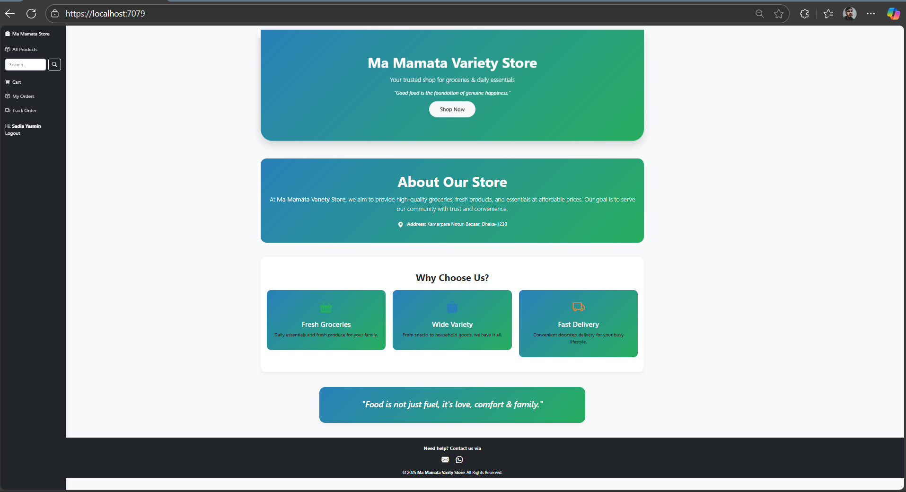
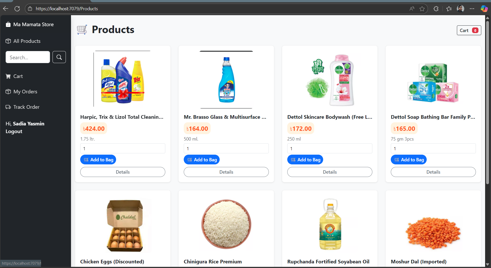

# Maa Mamata Variety Store 🛍️

An ASP.NET MVC-based e-commerce web application for managing a variety store.  
The system supports customer shopping features and admin controls for product and order management.

---

## ✨ Features

- **User Features**
  - Browse products by category
  - Add products to cart
  - Manage cart (increase, decrease, remove, clear items)
  - Checkout and place orders

- **Admin Features**
  - Role-based authentication (Admin / Customer)
  - Manage products (create, edit, delete, upload images)
  - View and manage orders
  - Inventory management

- **General**
  - Responsive UI with Bootstrap 5
  - Modern, clean design
  - SQL Server database integration

---

## 📸 Screenshots

### Homepage


### Product Page


---
## 🛠️ Tech Stack

- **Framework:** ASP.NET MVC (.NET 9 / .NET Core MVC compatible)  
- **Frontend:** HTML5, CSS3, Bootstrap 5, JavaScript  
- **Backend:** C# (ASP.NET MVC)  
- **Database:** SQL Server (Entity Framework Code First)  
- **Version Control:** Git & GitHub  

---

## 🚀 Getting Started

### Prerequisites
- Visual Studio 2022 (or later)
- .NET SDK (9.0 or latest)
- SQL Server / LocalDB

### Setup
1. Clone this repository  
   ```bash
   git clone https://github.com/InfinityAbir/Maa-Mamata-Variety-Store.git
2. Open the solution in Visual Studio.
3. Update the connection string in appsettings.json (or Web.config for MVC 5).
4. Run the database migrations:
      ```bash
      Update-Database
5. Build and run the project (Ctrl + F5).
---
Some users may experience a problem when trying to upload images in the product creation page through Visual Studio. The file dialog may close unexpectedly or the IDE may stop.

Solution:
Run the project using the command line instead of Visual Studio.
### Setup
1. Go to the project directory (example: C:\Users\Lenovo\Desktop\Project\E-Commerce-website-main)
2. Open command prompt & run:
   ```bash
   dotnet run
3. Now Open the link & create product.
---

### Email: abir@gmail.com
### Password: 123456789

---
If user accidentally drop the database.
Solution:
Case: No Admin exists yet
After dropping the database-
When you open /Account/CreateAdmin:

The code checks your Users table.

If no user with role = Admin is found → it creates a default Admin account:

Email: admin@yourapp.com

Password: 123456 (⚠️ plain for now, but can be hashed)

You’ll see the message:
✅ Admin account created. Email: admin@yourapp.com, Password: 123456

At this point, you can log in with that account.
---
